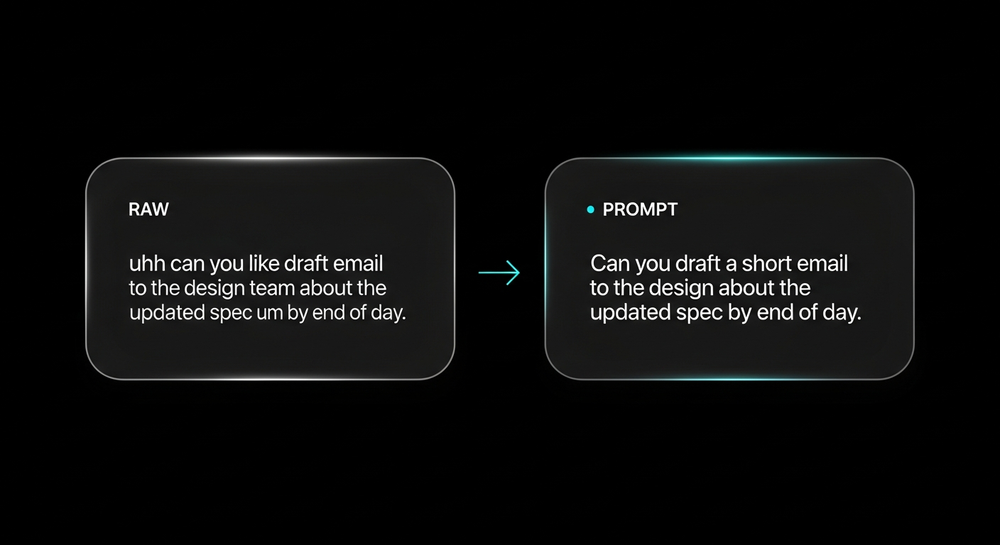

<p align="center">
  
</p>

<h1 align="center">Air Prompt</h1>

<p align="center">
  <b>Speak on your phone. Cleaned text pastes on your Mac.</b><br>
  On-device speech recognition · AI cleanup · QR pairing · auto-paste.
</p>

<p align="center">
  
</p>

---

## What it is

Air Prompt is a cross-device dictation tool. You hold a button on your phone, speak, and the cleaned transcription appears in whichever Mac app has focus — email, Slack, code editor, wherever.

Audio never leaves the phone. Transcription happens on-device via the Web Speech API; only the resulting text is sent over an authenticated WebSocket to a relay that forwards it to your paired Mac widget.

## Features

| | |
|---|---|
| **On-device STT** | Web Speech API runs locally on the phone — no audio uploaded |
| **AI cleanup** | Optional Gemini Flash-Lite pass fixes grammar, punctuation, filler words |
| **QR pairing** | Scan the Mac widget's QR from your phone — no manual session IDs |
| **Auto-paste** | Dictated text lands in the focused Mac app via Accessibility Services |
| **Dual modes** | `raw` (verbatim) or `prompt` (AI-cleaned) — toggle per session |
| **Ephemeral** | No transcripts stored server-side — only anonymized usage metrics |
| **Multi-provider auth** | Google, Apple, GitHub — via Firebase |
| **One-line install** | `curl \| bash` on Mac; PWA on any modern phone browser |

## Install

**Mac** (universal binary, macOS 12+):

```bash
curl -fsSL https://airprompt.fly.dev/install.sh | bash
```

**Phone**: open `https://airprompt.fly.dev/` in any modern browser. Add to home screen for a full-screen PWA experience.

See [docs/install.md](docs/install.md) for fallback and manual install.

## How it works

1. Launch the widget on Mac and sign in (Google / Apple / GitHub via Firebase).
2. Click the QR icon — widget expands to show a pairing QR.
3. Open `airprompt.fly.dev` on your phone, sign in to the same account, scan the QR.
4. Press and hold **Hold to talk**. Speak. Release.
5. Text auto-pastes on your Mac.

<p align="center">
  
</p>

See the full [walkthrough](docs/walkthrough.md) for screen-by-screen visuals.

## Architecture

```
phone PWA              mac widget
(Web Speech API)      (SwiftUI, AX paste)
     │                      │
     └────── WebSocket ─────┘
                 │
        ┌────────┴────────┐
        │ Fly.io backend  │
        │ Node · ws · pg  │
        └───────┬─────────┘
                │
           Gemini API
        (Flash-Lite cleanup,
         prompt mode only)
```

- **No audio on the wire.** Transcription is browser-native on the phone.
- **No transcripts stored.** Backend keeps only usage counters (chars, tokens).
- **Per-user sessions.** Firebase ID token verified on every WS message.

Full detail in [docs/architecture.md](docs/architecture.md).

## Status

| | |
|---|---|
| **Mac widget** | SwiftUI, universal binary, menu-bar pill widget |
| **Phone** | PWA (Chrome / Safari / Edge) |
| **Backend** | Node.js + TypeScript on Fly.io, single region, Postgres |
| **Auth** | Firebase — Google, Apple, GitHub providers |
| **LLM** | Gemini 2.0 Flash-Lite (cleanup only) |
| **Windows** | PWA only — no native widget yet |

## Privacy

- Audio stays on-device (Web Speech API runs in-browser)
- Only the final text string is relayed; no audio bytes hit the server
- No transcript persistence — only metric rows: `(user_id, timestamp, input_chars, output_chars, mode)`
- Sessions are in-memory with a 30-minute idle TTL
- Every WebSocket message carries a Firebase ID token that the server re-verifies

## Source

The application source lives at **[github.com/aakashnarukula-dev/airprompt](https://github.com/aakashnarukula-dev/airprompt)**. This repository is the public showcase — docs, walkthrough, and design-language reference.

## License

See the source repo for license details.
